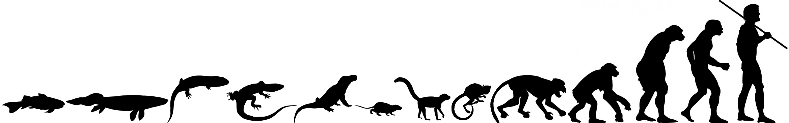

# React.js Genetic Algorithm Boilerplate

## What is a Genetic Algorithm?

Genetic Algorithms apply principles from biological evolution to find solutions to problems with no human input. The solution to the problem automatically evolves from random and incorrect trials and it gets better over time until the goal is reached.

## Can I see some examples to help me understand this?
Put all this in perspective and to get you excited have a look at a few inspiring examples where developers used genetic algorithms to search for unknown solutions to known problems:
 - https://www.youtube.com/watch?v=qv6UVOQ0F44
 - https://www.youtube.com/watch?v=bBt0imn77Zg
 - https://www.youtube.com/watch?v=Gl3EjiVlz_4
 - https://www.youtube.com/watch?v=uwz8JzrEwWY
 - https://www.youtube.com/watch?v=8vzTCC-jbwM
 - https://www.youtube.com/watch?v=pgaEE27nsQw

## What are the core principles this algorithm inherits from Nature and the Darwinian Evolution?
In order for natural selection to work like in Nature, all three of the below has to happen:

 - **Heredity**: Creatures pass down their genetic information (DNA) to their offsprings to the next generation if they live long enough to be able to reproduce. 
 
 - **Variation**: Variety must be present when heredity happens. If all creatures are exactly the same then with no variation the species can't evolve. Variation normally happens when the genetic information of the parents mix at reproduction and with the random mutation.

 - **Selection**: Successful members of the population become parents and pass down their genetic information, unsuccessful ones die without offsprings. This is what we normally refer to as “survival of the fittest.” Natural selection is what allows a species to evolve and each generation to be more successful than their parents.

 
 
## How can this be used in a computer algorithm to solve other, generic problems?

You first have to start by defining your goal. **Remember that even though we use ideas from Nature, the goal of your algorithm can be ANYTHING.** The goal needs to be measurable and easily comparable to the performance and efficiency of each member of the population as members in the population represent the potential solution to the problem.

In the first generation the population is filled with members (solutions) that are completely random. In this completely random pool there are always a few who, by pure luck and chance, perform ever so slightly better than the others. These are the "fittest" members. At the end of the genereation the fittest, best performing variations are selected to become parents for the new generation.

Through many generations and rounds of natural selection solutions will become better and better. All this with no human input.

## What is the actual problem solved in the boilerplate?

The goal of the example Genetic Algorith project found in this repository is to find the string: "Hello Web on Devices".

Each member in the population of the first generation is a random string with the same length as the target string. This is essentially the DNA of the member that is going to be passed down from each parent. Remember that member = DNA, DNA = data representing the potential solution.

There is also a compare function that calculates a fitness score for each member. This is essential to decide how close are they getting to the goal. In this case this just a function that counts the matching characters between the target string and the DNA string of the member. If the DNA has one matching character at the same location, then the score is 1, if it has 5 then the score is 5. This score will help us select the best performing solutions to become parents for the new generation.

When two members reproduce to create an offsring they essentially combine their genetic information (DNA) which in this case means randomly combining the DNA string from each parent. Yes, this means that we may lose already matching characters, but overal, this mutation and variation help the solution evolve faster.

After a couple of dozen or hundred generations members in the generation will come closer and closer to the goal and eventually one of them will actually reach it.

## How all this is implemented in React.js?

There are two key classes to support the genetic algorithm: `DNA()` and `Population()`. Each member of the population is a new instance of the DNA class since that's their most defining property. The `DNA()` class provides methods like `crossOver`, `mutate` and `calcFitness` to support the reproduction mechanism. On the other hand the `Population()` class deals with higher level logic like natural selection, generating new populations and evaluating the fitness score of its members.

The `<World/>` React component is the entry point of the whole algorithm. This is what you can plug in to your existing React.js application. There's only one state in this component which keeps track of the best solution so far. The constructor of the component exposes some settings for the algorithm:
```
// Simulation settings
this.targetPhrase = 'Hello Web on Devices';
this.mutationRate = 0.01;
this.populationSize = 300;
```
You can try tweaking this try to speed up the algorithm.

This is also the place where the `Population()` class is initialised with the settings:
```
this.population = new Population(this.targetPhrase, this.mutationRate, this.populationSize);
```

When the component is mounted we call the `draw()` method which recursively calls itself using `requestAnimationFrame()`. The `draw()` method is where most of the algorithm happens:
```
draw() {

    // Generate weighed mating pool with the fittest members
    this.population.naturalSelection();

    // Generate new population of children from parents in the mating pool
    this.population.generate();

    // Calculate fitness score of the new population
    this.population.calcPopulationFitness();

    // Find the fittest member of the population and see if target is reached
    this.population.evaluate();

    // If target phrase is found, stop
    if (this.population.isFinished()) this.running = false;

    // Display best result so far
    this.setState({result: this.population.getBest()});

    // Loop and start new generation
    if (this.running) window.requestAnimationFrame(this.draw);
}
```

Finally, in the render function you can use the state to display the result.

## What else is this good for?

The boilerplate is universal which means the algorithm can be used to work on any problems where you can:
 - Define the goal with a function that can calculate the fitness score of each member
 - Define the DNA of each member that drives their behavior towards the solution
 
When you have these two defined then all you need to do is let the algorithm workout the logic.